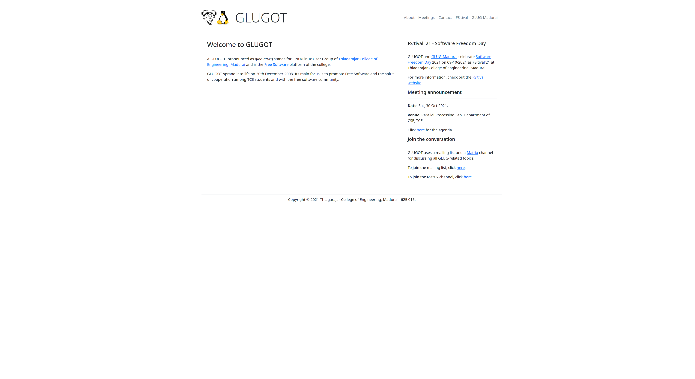
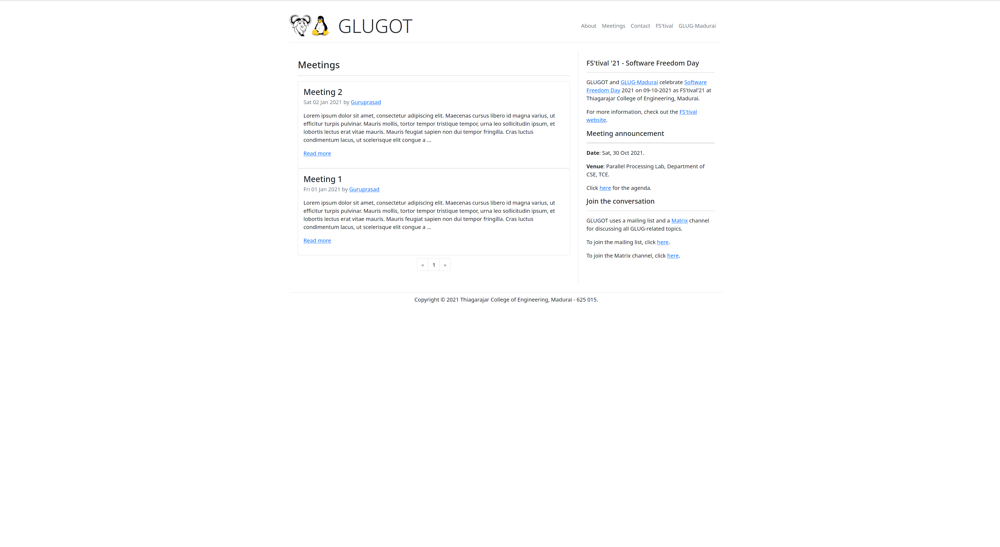
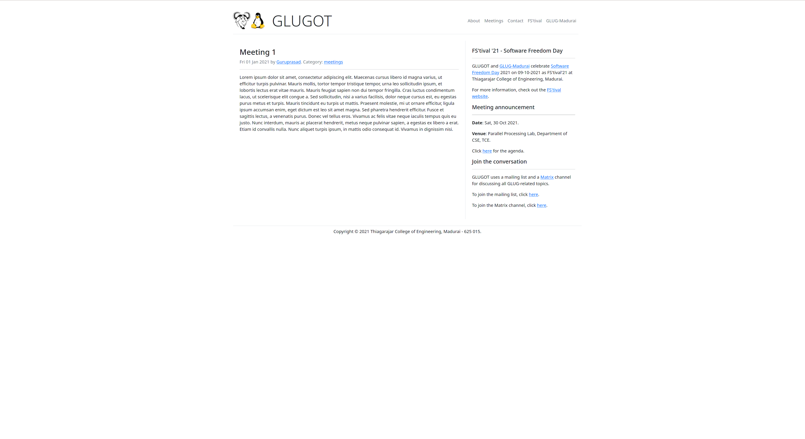

GLUGOT Pelican theme
====================

This repository contains the Bootstrap-5-based `glugot` [Pelican](https://blog.getpelican.com/) theme used by the [GLUGOT](https://glugot.tce.edu) website.

Screenshots
-----------

Usage
-----

Clone this repository using the folder name `glugot` and install it by following the steps in the Pelican documentation [here](https://docs.getpelican.com/en/latest/pelican-themes.html).

Configuration
-------------

The available configuration options are documented in the [sample pelican configuration file](./pelicanconf.py.sample) in this repository.
